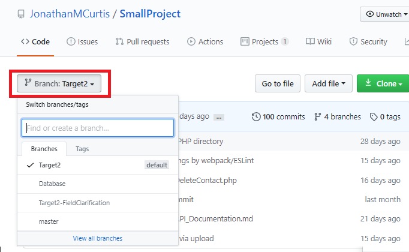
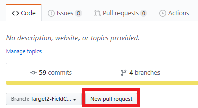
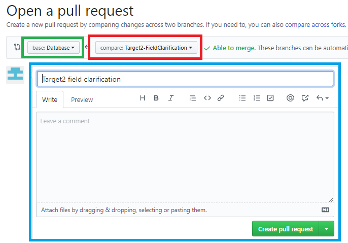

## Using Github - Sharing Your Work
You've gotten to a point in the project where you have a useful feature to share. Now is the point where you make sure 
it fits in with the work that everyone else is doing!

---

#### Terms

(If you're familiar with Git terminology, feel free to skip this section)

There are a few terms that we will use. These are important to know for the Github process and while the exact process 
may differ depending on what you are using for Git on your PC, the terminology should be consistent between platforms.

- You can think of a **commit** as a 'save point' for your code. It is a snapshot of everything you let Git keep track of,
 and details the history of the project.
- If commits are save points, a **branch** is a separate save file. A branch is simply a point where the history of your 
project diverges, and each branch tracks a different set of commits.
- A **remote** repository refers to a repository not local to your computer, usually the one you will send changes to.
- When you **check out** a branch, you're making a copy of a remote branch on your local machine.
- When you use **fetch**, you're adding changes from a remote repository to your own (*without* committing them.)
- When you use **pull**, you're adding changes from a remote repository to your own (and committing those changes.)
- (Use this carefully!) When you **rebase** your branch, you are pulling a specific commit and replaying your own changes on top of it.  
- When you **push** your changes, you're uploading your changes to a remote repository.
- When a branch is **merged**, you are taking the changes from one branch and applying them to one you branched off of.
- When you submit a **pull request**, you are requesting that someone merge your changes into another branch.

---

#### The Git Workflow

###### (Sync, Fetch, Pull)

Just like when you were working locally, there may be changes to the project since you started your branch that will 
prevent you from proceeding.

If you're using a forked repo, this will not be an issue (as you are the only one making changes there.) 

You may need to [**sync**](https://help.github.com/en/github/collaborating-with-issues-and-pull-requests/syncing-a-fork) 
your forked repository to the upstream repo (you should only need to do this if you are using a forked repo, and there 
is a change you need to work based off of.)

You may need to [**fetch**](https://help.github.com/en/github/using-git/getting-changes-from-a-remote-repository#fetching-changes-from-a-remote-repository)
the changes made to a remote repository, in case you want to check them before committing them to your local repository.
 
You may need to [**pull**](https://help.github.com/en/github/using-git/getting-changes-from-a-remote-repository#pulling-changes-from-a-remote-repository)
the changes made to a remote repository into yours, which will commit those changes locally.

If you are working from a **clone** of a repository, and attempting to send your work to a branch that has changed, you 
will not be able to proceed without bringing those changes into your files!

###### (Push)

Once you have your branch up to date with the one you want to send to, now is the time to **push** your changes to the 
remote repository.

**Make sure** you have selected the correct branch to send your work to. *Ideally*, it should be one you checked out before 
beginning your work (so that it is not a branch someone else has begun their work from.) 

###### (Pull Request)

Once you have pushed your changes to Github, it is time to make a **Pull Request!**   

Start by making sure you are on the right branch on the Github website (the one you just pushed to) using the 'Branch' box shown below

Next, submit a Pull Request by clicking the 'New pull request' button next to it:

This will open a form which will allow you to see the branch you want merged (red), the branch you're trying to merge into 
(green), and the area where you can provide information on what this Pull Request changes (blue.)

Once you submit this, one of the repository administrators will review your request to see if there are any merge conflicts,
and resolve those to ensure the project works when it includes everyone's changes!

---

That should be everything you need to know to get up and running using Git and Github for this project (or in the future.)
I hope that this was helpful.

\- Curtis 